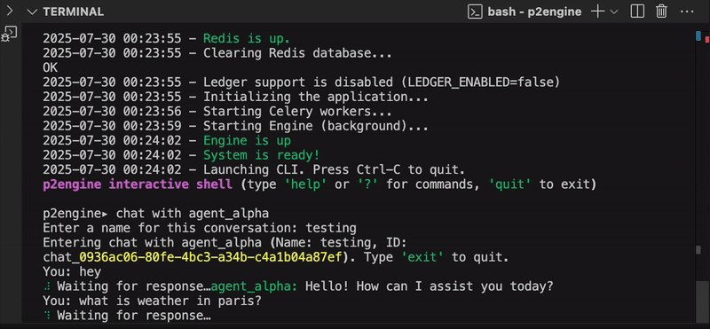

<!-- Hero -->

<h1 align="center">P2Engine — Multi-Agent System (WIP)</h1>

<p align="center">
  Orchestrate many AI agents with <i>observable</i> workflows, 
  <i>adaptive</i> evaluation loops, and an <i>auditable</i> trail.
</p>

<p align="center">
  <a href="https://img.shields.io/badge/status-WIP-orange">
    
  </a>
  <a href="https://img.shields.io/badge/framework-Exploratory-blueviolet">
    
  </a>
  <a href="https://img.shields.io/badge/license-Academic-lightgrey">
    
  </a>
  <a href="https://img.shields.io/badge/python-3.11%2B-informational">
    
  </a>
</p>

<p align="center">
  <a href="#quicklinks">Quick Links</a> •
  <a href="#primer">Primer</a> •
  <a href="#gallery--four-validation-scenarios-22">Gallery</a> •
  <a href="#getting-started">Getting Started</a> •
  <a href="#roadmap">Roadmap</a> •
  <a href="#research--publication">Research</a>
</p>

---

P2Engine explores how multiple AI agents can coordinate, critique, and improve each other in open-ended tasks.  
Think of it as a <em>framework</em> for multi-agent systems — but still evolving and work-in-progress.

The framework emphasizes four pillars: **orchestration**, **observability**, **adaptation**, and **auditability**.  
Agents collaborate through flexible workflows, log everything for inspection, learn via judge/rollout loops, and leave a tamper-evident trail for accountability.

---

## Quicklinks

- **Test it now:** [GitHub Repo](REPO_URL) · Examples in [`demos/`](demos/)
- **Docs (stub):** [`p2engine/README.md`](p2engine/README.md)
- **Contact:** adam.sioud@protonmail.com · surya.b.kathayat@ntnu.no

---

## Primer

[**Test the framework on GitHub**](REPO_URL) —  
P2Engine is the main artefact of a master’s thesis project. This page gives you a snapshot:  
we sketch the design, show demos, and point to what’s most relevant.  
Expect this repo to grow and evolve as the framework matures.

### Why it matters

- **Agentic workflows** without rigid pipelines.  
- **Transparency** — full runs are observable and auditable.  
- **Self-improvement** via judge/rollout-driven adaptation loops.  

---

## Gallery — Four Validation Scenarios (2×2)

> Temporary: all cells use `demos/banner.gif` for consistent feel.

**Row 1**

| E1 — Orchestration                                                                 | E2 — Observability                                                                 |
| ---------------------------------------------------------------------------------- | ---------------------------------------------------------------------------------- |
| <div align="center"></div> | <div align="center"></div> |

**Row 2**

| E3 — Adaptation Loops                                                              | E4 — Audit Layer                                                                   |
| ---------------------------------------------------------------------------------- | ---------------------------------------------------------------------------------- |
| <div align="center"></div> | <div align="center"></div> |

---

## Getting Started

> Local development only for now.

```bash
# 1) Clone
git clone <REPO_URL> && cd p2engine

# 2) Create env & install
python -m venv .venv && source .venv/bin/activate
pip install -U pip wheel
pip install -e .

# 3) Run a demo
python -m demos.e1_orchestration
