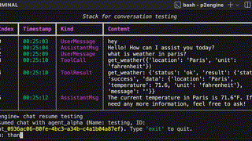
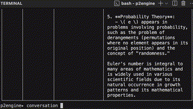
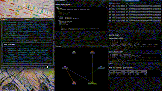
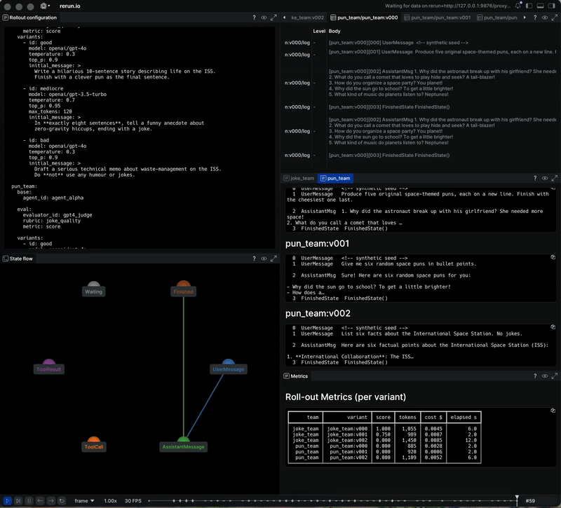

<h1> P2Engine: A Multi-Agent System Framework</h1>

<b> A framework + runtime to build, run, and evaluate multi-agent systems. Extended with the Canton Network to enable monetary incentives, payments, and audits. </b> 

 

"Coordinate agents, evaluate each step, store trajectories, replay & observe"

 

The full framework lives inside the [`p2engine/`](p2engine/) directory, with setup instructions and detailed documentation in [`p2engine/README.md`](p2engine/README.md).

I’ve also written an article on P2Engine, the research , the ideas, tech, and more.. [Read it here →](https://www.adamsioud.com/projects/p2engine.html)

[Showcase](#showcase) • [P2Engine](#p2engine) • [Rollouts](#rollouts) • [Section 4](#section-4) • [Section 5](#section-5) • [Section 6](#sectoin-6)

---

## Showcase

_Click any demo below for a full video demonstration_

|                                           **Agent Delegation**                                            |                                           **Branch Rewind**                                            |
| :-------------------------------------------------------------------------------------------------------: | :----------------------------------------------------------------------------------------------------: |
|  |  |

|                                           **Rollout with Rerun Logging & Visualizing**                                            |                                           **Ledger Operations**                                            |
| :-------------------------------------------------------------------------------------------------------------------------------: | :--------------------------------------------------------------------------------------------------------: |
|  |  |

**Agent Delegation** — Agents can delegate tasks to sub-agents, and conversation state is tracked.

**Branch Rewind** — Rewind a conversation to x state, branch identifiers preseve causality, and bracnhes could be checked in&out from

**Rollout with Rerun Logging & visualization** — Use rollouts, with rollouts you can configure rubrics, agent teams, and variants, and then test them across different scenarios and tools. Coupled with rerun visualization get a full observablity and track it all.

**Ledger Operations** — [maybe dont want the word ledger operations] Agents maintain wallets on Canton Network, perform autonomous transfers, and all transactions are immutably recorded.

---

## P2Engine

[we need a better title to say here, like we are describing p2engine in full yes, hmm]

P2Engine's architecture and internals are inspired by a beautiful and well-thought-out blueprint laid down by [Erik](https://eriksfunhouse.com). His architecture proposal and taste for systems, agents, tools, prompt templates, etc. have guided P2Engine to what it is today. A total recommendation: check out his series, here is [Part 1](https://eriksfunhouse.com/writings/state_machines_for_multi_agent_part_1/), and then continue to [Part 2](https://eriksfunhouse.com/writings/state_machines_for_multi_agent_part_2/), [Part 3](https://eriksfunhouse.com/writings/state_machines_for_multi_agent_part_3/), and [Part 4](https://eriksfunhouse.com/writings/state_machines_for_multi_agent_part_4/).

P2Engine’s orchestration is fundamentally built on finite state machine (FSM) principles, where each agent conversation progresses through well-defined states with explicit transition rules. This approach provides predictable behavior while enabling complex multi-agent interactions.

At its core, P2Engine runs LLM-agents in discrete steps. Each step produces artifacts, and a separate and async evaluator scores them. You can think of it like this: the agent thinks, acts, and creates something; the evaluator observes, scores, then which is not yet implemented the root/router or evaluator takes the feedback then decides the next tool, step, or configuration. [hmm this needs to be clearer written kinda, and also is a tad bit negative no?]

[before the ramble which i like, aybe we are missing one or two paragrpahs to explain p2engine here? hmm]

So To ramble, and quickly summaries what P2Engine has, it gives us agent interfaces, tool registry, templates/personas, runtime policies. A pushdown automata esque, it is a finite state machine with an interaction stack. It has branching, rewind, artifacts and an artifacts bus, Redis-backed session/state. Judge prompts, metrics, branch scoring, rollout experimentation. Chat, artifacts inspect/diff, rollouts, ledger ops, conversation watch. Rich logs; optional with rerun views and real-time log print outs. And the ledger (Canton/DAML) integration gives us balances, transfers, and audit trails.

---

## Rollouts

  
   
  <em>Click for a full video demonstration</em>

With P2Engine you can build systems however you like. And rollouts is the place we do this now, they are kind of our , Simulations are executed via rollouts ([runtime/rollout/cli.py](p2engine/runtime/rollout/cli.py)) with configuration files (e.g., [config/rollout_ledger_demo.yml](p2engine/config/rollout_ledger_demo.yml)) defining reproducible scenarios. These demonstrate that p2engine effectively enables coordination across diverse agent roles, ensures traceability through ledger-backed records, manages payments seamlessly, and supports judgment with automated evaluation tools. Results (metrics, visualizations) presented in the thesis empirically validate the system's feasibility and provide foundation for future research directions.

Rollouts set the stage for adaptation methods. The rollout system provides A/B testing capabilities for systematically comparing different agent configurations, tool combinations, and behavioral parameters. Implemented in the [runtime/rollout/](p2engine/runtime/rollout/) module, it integrates seamlessly with the Celery task system for distributed execution, enabling parallel evaluation of multiple configuration variants. The system uses YAML configuration files to define rollout experiments, specifying teams, base settings, variants, and evaluation criteria.

---

## Section 4

### Ledger

[is it leger that will call it? this is like the question im asking myself ledger, ledger operations]

Canton Network, The network of networks as they say, currently in our framework here it serves as a great enable to test out working with a ledger for some basic stuff. It gives us and it has the functions which something like P2Engine in the future will happen to like to explore such as, more on this and why -> artilce

 

In addition to all these great stuff, With Eriks ideas we have something that, and it made it simple to extend it with canton network for us. Here we do.. We extend P2Engine with the integration of distributed-ledger technology to provide immutable audit trails, privacy-aware operations, and verifiable accountability for all agent actions and financial transactions. This pillar ensures that the system maintains a permanent, tamper-evident record of all significant operations, supporting both regulatory compliance and its own system verification.

- Canton Network/DAML integration: Ledger operations implemented in services/canton_ledger_service.py.
- Financial accountability: Agent wallets, transfers, and transaction history logged on-chain.
- Complete audit trails: Every interaction and side-effect routed through ledger hooks in infra/ledger_hooks.py.

---

## Section 5

lets go some diagrams to get some intution, this is not like the core but yeh

### Architecture Diagrams

#### Figure 5.3.1 — Execution Sequence

  
   
  <em>Figure 5.3.1: Execution Flow</em>

The system execution follows the sequence shown in Figure 5.3.1, demonstrating end-to-end integration across all architectural layers. The execution unfolds through six integrated stages:

- **Agent Processing** — Consumes conversation states and produces responses or tool invocations.
- **Tool Execution** — Runs asynchronously, publishing results back into the conversation streams.
- **State Progression** — Captures every activity as state transitions flowing through the orchestration layer.
- **Event Publication** — Automatically pushes those state changes to the observability layer for real-time monitoring and analysis.
- **Evaluation Triggering** — Fires upon conversation completion or significant milestones, invoking automated quality assessments.
- **Adaptation Feedback** — Uses evaluation results to refine future agent configurations via the adaptation layer.

---

#### Observability Events — Unified Event Stream

  
   
  <em>Unified observability: every interaction captured for full traceability</em>

The observability architecture is built around four core mechanisms:

- **Universal Event Streaming** — Ensures that every system activity flows through a central event stream, making agent decision-making and system-wide behavior patterns fully transparent in real time.
- **Complete Traceability** — Records both metadata and payload in each event, preserving causal links across all agent interactions for a holistic understanding.
- **Real-time Transparency** — Leverages live event streams to power operational monitoring and debugging interfaces, keeping the system observable during execution.
- **Event Logs** — Captures events exhaustively for post-hoc examination of agent behaviors and system performance.

---

#### Figure 5.2.2 — Orchestration FSM

  
   
  <em>Figure 5.2.2: Finite State Machine Flow</em>

The purpose of the orchestration layer is to enable dynamic agent coordination where the system itself decides task distribution and agent deployment through emergent, configurable behavior. The orchestration layer implements finite state machine orchestration, ensuring coherent state progression while enabling dynamic routing decisions and handling non-deterministic outputs from agents.

The design rests on four interlocking ideas, fully inspired by Erik’s work (Erik 2025a; Erik 2025b; Erik 2025c; Erik 2025d):

- **Emergent Coordination** — Empowers the system to decide at runtime how many agents to deploy and how to assign tasks, moving beyond rigid sequential workflows to truly configurable behavior.
- **Finite State Machine Control** — Governs state transitions with explicit rules and handlers, ensuring deterministic progression while allowing dynamic routing based on agent outputs.
- **Conversation Branching** — Allows interaction histories to fork at any point, supporting experimental workflows and comparative analyses of different coordination strategies.
- **Dynamic Agent Delegation** — Enables agents to spawn sub-agents and sub-conversations, creating a hierarchical task decomposition that emerges from actual system needs rather than a predetermined plan.

---

#### Figure 6.3.7 — Transaction Flow

  
   
  <em>Figure 6.3.7: From initiation to ledger confirmation</em>

The transaction flow ensures that all financial operations follow a consistent pattern with proper validation, execution, and recording. Figure 6.3.7 illustrates the complete flow from initiation to ledger confirmation.

**Audit & money movement context.** The flow is anchored by an audit layer: every balance change and transfer (Canton/DAML) is appended to an immutable trail with the relevant metadata. This supports post-hoc inspection, compliance reporting, and reconciliation, while keeping operational paths simple and verifiable.

---

## Sectoin 6

### Future

Next, completing a minimal learning loop (prompt/RL-style) that tunes prompts/tools(what they could use)using stored trajectories.

So what’s in store for P2Engine? I think it makes sense to focus on one core functionality and make it great. To start, that means improving rollouts and completing the feedback loop so rewards can feed back into the system and drive adjustments.

A good first step is for the root/router agent to change parameters, models, or the system prompt, essentially acting as an approach optimizer. That alone would be a powerful feature. It learns which prompts models to adjust what works which approaches worked etc

Once that’s in place, we could look at turning the project into an MVP for an agent marketplace, introducing more learning, and testing different collective intelligence hypotheses.

But the most exciting and quickest win right now is experimenting with completing the learning loop and trying out different approaches to learning, starting with system prompt optimization (or approach optimization), which ties directly
into this idea I’ve outlined here:

- A tweet by Karpathy on System Prompt Learning, https://x.com/karpathy/status/1921368644069765486,
- [Against RL: The Case for System 2 Learning](https://blog.elicit.com/system-2-learning /)
- [Part 4: Improving agent reasoning, By Erik](https://www.arnovich.com/writings/state_machines_for_multi_agent_part_4/]
  - [More Thoughts on Agents](https://www.arnovich.com/writings/more_on_agents/).

All three sources advocate for lifting LLM adaptation and reasoning above mere parameter updates. Karpathy calls out a “System Prompt Learning” paradigm where models learn explicit, note‑like strategies in their system prompts rather than just by changing weights

But we will se im currently working on owl (link), learnings and perspectives will i take and adjust our new inspiration when we come back to P2Engine

What you could do here is like just 1 sentence, in a new section at the end. Like during the development of p2engine, its research and one idea evolved around introducing a market participant for the market place, to use that to do x y z, interested, see here.
