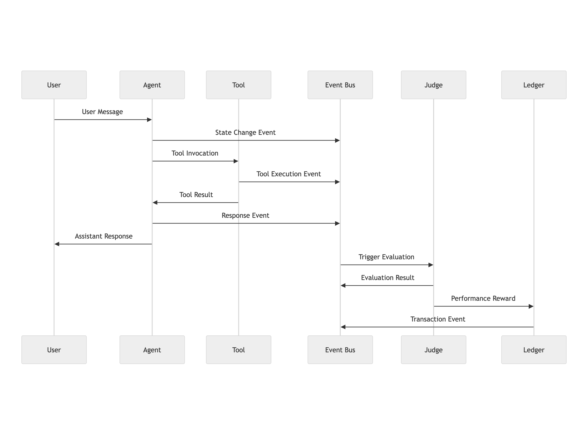
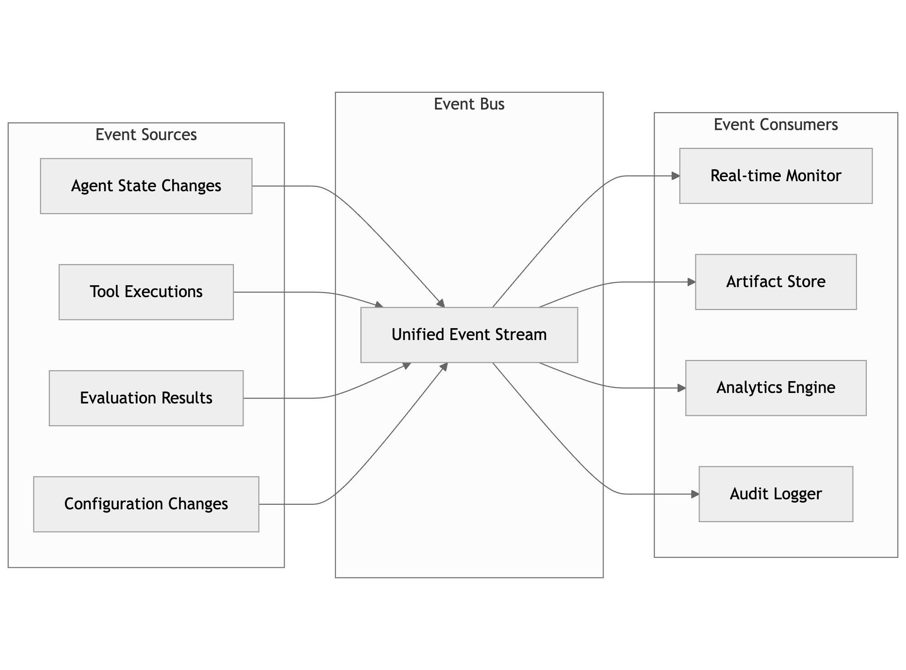
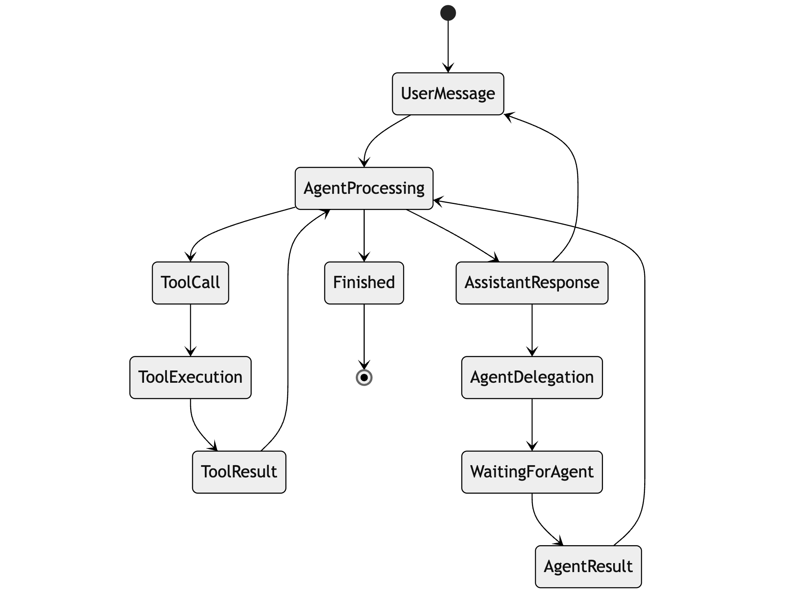
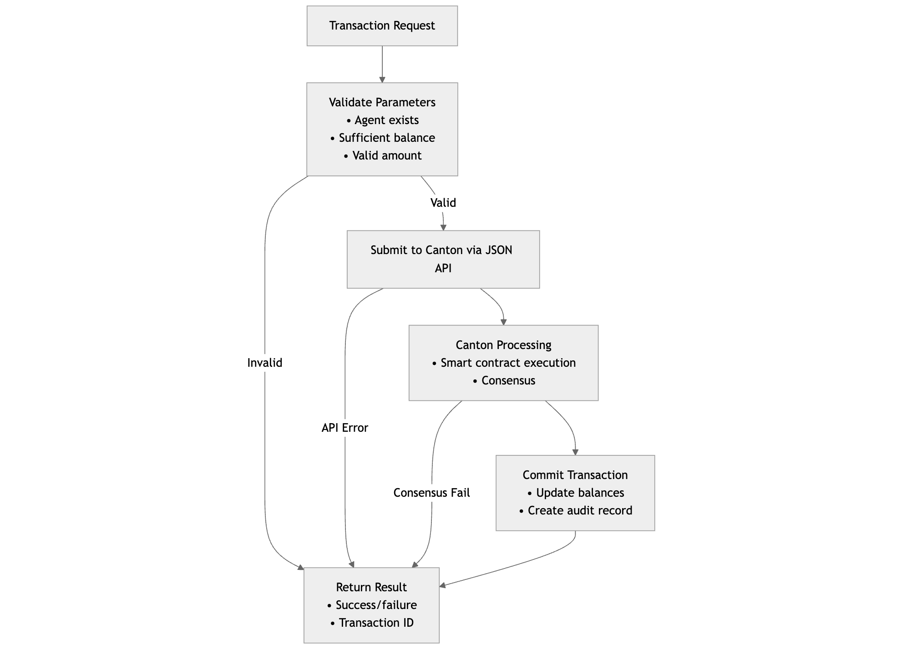

<h1 align="center">P2Engine: A Multi-Agent System Framework</h1>

<strong>A framework + runtime to build, run, and evaluate multi-agent systems. Extended with the Canton Network to enable monetary incentives, payments, and audits.</strong>

<strong>The primary entry point is <code>p2engine/README.md</code>, which offers setup
instructions and a full overview of the framework.</strong>

Orchestrate many AI agents with <em>observable</em> workflows, <em>adaptive</em> evaluation loops, and an <em>auditable</em> trail.

<a href="p2engine/">Try it Out</a> •
<a href="demos/">Demos</a> •
<a href="https://www.adamsioud.com/projects/p2engine.html">Article</a> •
<a href="#functionalities">Functionalities</a> •
<a href="#rollout">Rollout</a> •
<a href="#architectures">Architectures</a> •
<a href="#hello">What it Does</a> •
<a href="#future">Future</a>

---

<table>
<tr>
<td align="center" width="50%" valign="top">
   <strong>E1 — Agent Delegation</strong>
</td>
<td align="center" width="50%" valign="top">
   <strong>E2 — Branch Rewind</strong>
</td>
</tr>
<tr>
<td align="center" width="50%" valign="top">
   <strong>E3 — Rollout with Rerun</strong>
</td>
<td align="center" width="50%" valign="top">
   <strong>E4 — Ledger Operations</strong>
</td>
</tr>
</table>

<strong>Explore advanced capabilities and enterprise features with our extended suite.</strong>

  
<a href="#extended-features"><strong>View Extended Features →</strong></a>

---

<h2 align="center" id="rollout">Rollout</h2>

<h3>Global Rollout Strategy</h3>

<table width="100%">
<tr>
<td width="50%" valign="middle">

<strong>Experience seamless deployment across multiple environments with our comprehensive rollout strategy—from local development to enterprise-scale production.</strong>

<strong>Multi-Environment Support</strong> — Development, staging, and production deployments with consistent configuration management across all environments.

<strong>Scalable Infrastructure</strong> — Auto-scaling based on demand with intelligent load distribution and resource optimization.

<strong>Global Distribution</strong> — Edge computing and regional deployment options for reduced latency and improved performance worldwide.

<strong>Enterprise Integration</strong> — Seamless connection with existing enterprise systems through standardized APIs and protocols.

<a href="#deployment"><strong>Learn More About Deployment →</strong></a>

</td>
<td width="50%" align="center">
  
   <em>Rerun Showcase — click to open full viewer</em>
</td>

</tr>
</table>

---

<h2 align="center" id="functionalities">Functionalities</h2>

<table width="100%">
<tr>
<td width="50%" valign="middle">

<h3>Core Platform Features</h3>

<strong>Multi-Agent Orchestration</strong> — Coordinate complex workflows across multiple AI agents with dynamic task allocation and load balancing for real-time agent communication and collaboration.

<strong>Observable Operations</strong> — Comprehensive monitoring dashboards provide real-time performance metrics and debugging capabilities to trace agent decision paths.

<strong>Adaptive Learning</strong> — Continuous improvement through feedback loops, performance optimization algorithms, and automated model fine-tuning.

<strong>Audit & Compliance</strong> — Complete transaction logging with Canton Network integration for financial transparency and regulatory compliance reporting.

</td>
<td width="50%" align="center">

<ul>
<li><strong>Real-time Monitoring</strong> — Live agent performance tracking</li>
<li><strong>Dynamic Scaling</strong> — Auto-adjustment based on workload</li>
<li><strong>Cross-Platform Support</strong> — Works across all major platforms</li>
<li><strong>Plugin Architecture</strong> — Extensible agent development framework</li>
<li><strong>Smart Contracts</strong> — Automated payment and incentive systems</li>
<li><strong>Enterprise Ready</strong> — Production-grade security and reliability</li>
</ul>

</td>
</tr>
</table>

---

<table>
<tr>
<td align="center" width="50%">
   
  <strong>F1 — Real-time Analytics</strong>
</td>
<td align="center" width="50%">
   
  <strong>F2 — Custom Integrations</strong>
</td>
</tr>
<tr>
<td align="center" width="50%">
   
  <strong>F3 — Enterprise Security</strong>
</td>
<td align="center" width="50%">
   
  <strong>F4 — Global Deployment</strong>
</td>
</tr>
</table>

---

<h2 align="center" id="architectures">Architectures</h2>

<table width="100%">
<tr>
<td width="50%" valign="middle">

<h3>System Architecture Overview</h3>

<strong>Distributed Computing Layer</strong> — Microservices-based architecture with container orchestration using Kubernetes for auto-scaling and load distribution.

<strong>AI Agent Framework</strong> — Plugin-based agent development with multi-modal agent support and cross-platform compatibility for maximum flexibility.

<strong>Blockchain Integration</strong> — Canton Network integration for financial operations, smart contract templates, and decentralized identity management.

<strong>Data & Analytics</strong> — Real-time data processing with advanced analytics, reporting capabilities, and machine learning pipeline integration.

</td>
<td width="50%" align="center">

<ul>
<li><strong>Microservices Architecture</strong> — Scalable and maintainable design</li>
<li><strong>Container Orchestration</strong> — Kubernetes-based deployment</li>
<li><strong>API-First Design</strong> — RESTful and GraphQL endpoints</li>
<li><strong>Event-Driven Architecture</strong> — Real-time event processing</li>
<li><strong>Securit
