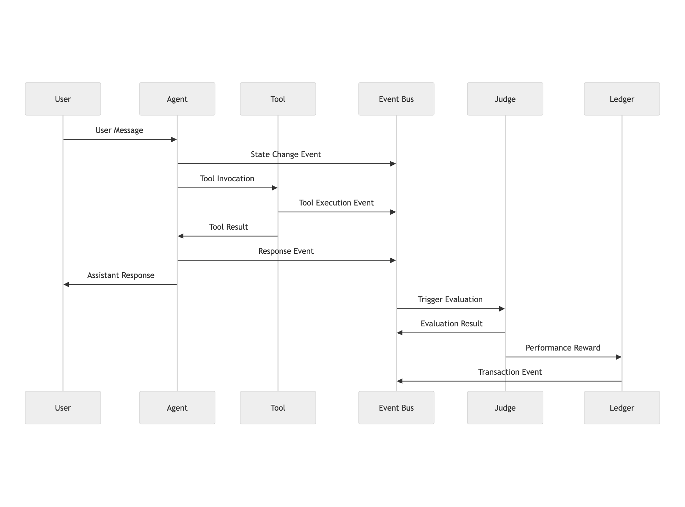
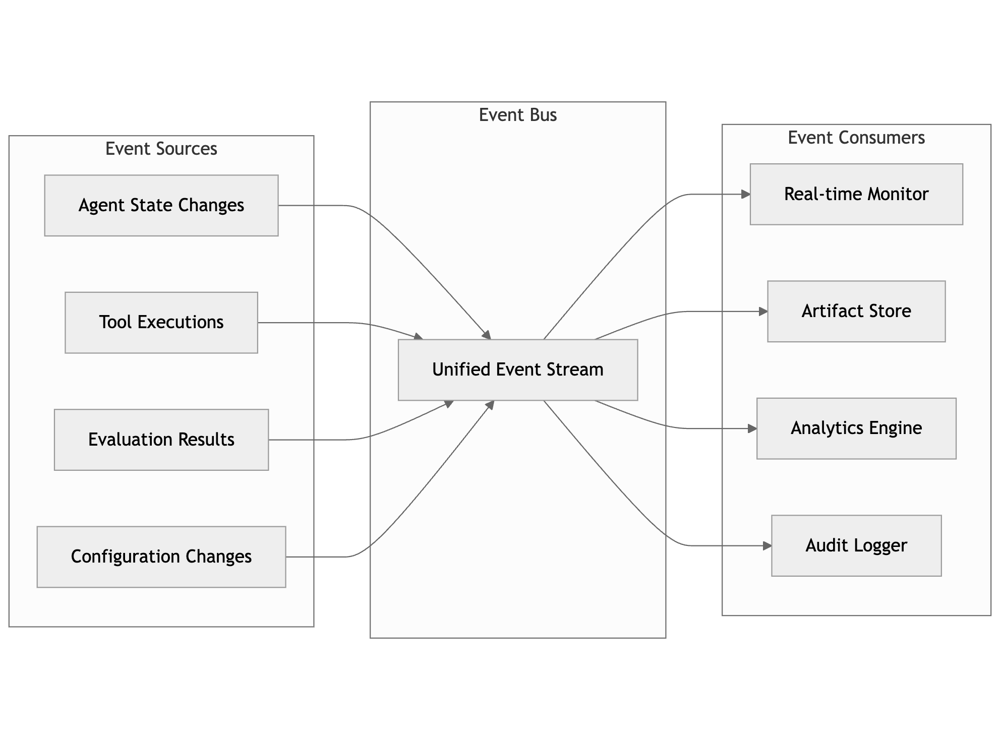
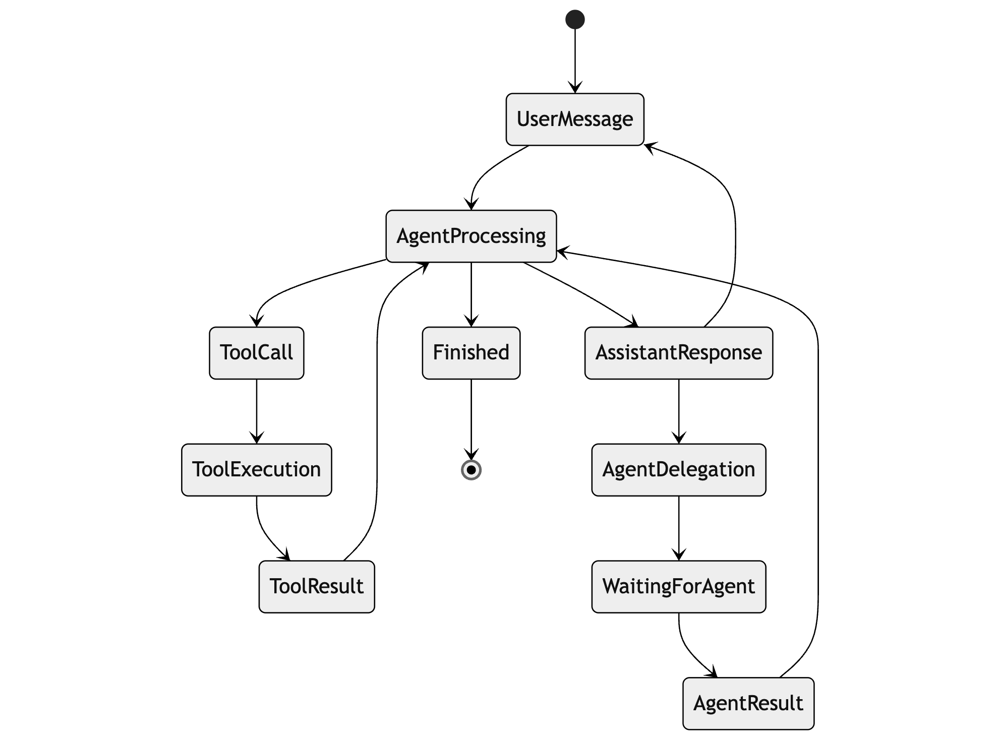
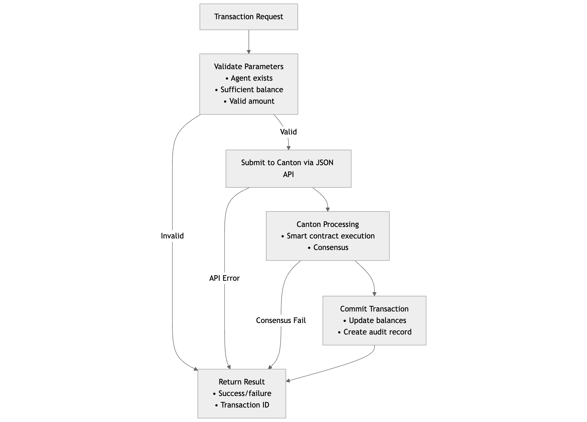

<h1 align="center">P2Engine: A Multi-Agent System Framework</h1>

<strong>A framework + runtime to build, run, and evaluate multi-agent systems. Extended with the Canton Network to enable monetary incentives, payments, and audits.</strong>

Orchestrate many AI agents with <em>observable</em> workflows, <em>adaptive</em> evaluation loops, and an <em>auditable</em> trail.

<a href="/p2engine/">Try it Out</a> •
<a href="/demos">Demos</a> •
<a href="https://www.adamsioud.com/projects/p2engine.html">Article</a> •
<a href="#functionalities">Functionalities</a> •
<a href="#rollout">Rollout</a> •
<a href="#architectures">Architectures</a> •
<a href="#hello">What it Does</a> •
<a href="#future">Future</a>

| E1 — Orchestration | E2 — Observability |
| :----------------: | :----------------: |
|  |  |
| **E3 — Adaptation Loops** | **E4 — Audit Layer** |
|  |  |

**Explore advanced capabilities and enterprise features with our extended suite.**

[**View Extended Features →**](#extended-features)

<h2 align="center">Rollout</h2>

### Global Rollout Strategy

<table width="100%">
<tr>
<td width="50%" valign="middle">

**Experience seamless deployment across multiple environments with our comprehensive rollout strategy. From local development to enterprise-scale production.**

**Multi-Environment Support** — Development, staging, and production deployments with consistent configuration management across all environments.

**Scalable Infrastructure** — Auto-scaling based on demand with intelligent load distribution and resource optimization.

**Global Distribution** — Edge computing and regional deployment options for reduced latency and improved performance worldwide.

**Enterprise Integration** — Seamless connection with existing enterprise systems through standardized APIs and protocols.

[**Learn More About Deployment →**](#deployment)

</td>
<td width="50%" align="center">

</td>
</tr>
</table>

---

<h2 align="center">Functionalities</h2>

<table width="100%">
<tr>
<td width="50%" valign="middle">

### Core Platform Features

**Multi-Agent Orchestration** — Coordinate complex workflows across multiple AI agents with dynamic task allocation and load balancing for real-time agent communication and collaboration.

**Observable Operations** — Comprehensive monitoring dashboards provide real-time performance metrics and debugging capabilities to trace agent decision paths.

**Adaptive Learning** — Continuous improvement through feedback loops, performance optimization algorithms, and automated model fine-tuning.

**Audit & Compliance** — Complete transaction logging with Canton Network integration for financial transparency and regulatory compliance reporting.

</td>
<td width="50%" align="center">

- **Real-time Monitoring** — Live agent performance tracking
- **Dynamic Scaling** — Auto-adjustment based on workload
- **Cross-Platform Support** — Works across all major platforms  
- **Plugin Architecture** — Extensible agent development framework
- **Smart Contracts** — Automated payment and incentive systems
- **Enterprise Ready** — Production-grade security and reliability

</td>
</tr>
</table>

---

| F1 — Real-time Analytics | F2 — Custom Integrations |
| :----------------------: | :----------------------: |
|  |  |
| **F3 — Enterprise Security** | **F4 — Global Deployment** |
|  |  |

<h2 align="center">Architectures</h2>

<table width="100%">
<tr>
<td width="50%" valign="middle">

### System Architecture Overview

**Distributed Computing Layer** — Microservices-based architecture with container orchestration using Kubernetes for auto-scaling and load distribution.

**AI Agent Framework** — Plugin-based agent development with multi-modal agent support and cross-platform compatibility for maximum flexibility.

**Blockchain Integration** — Canton Network integration for financial operations, smart contract templates, and decentralized identity management.

**Data & Analytics** — Real-time data processing with advanced analytics, reporting capabilities, and machine learning pipeline integration.

</td>
<td width="50%" align="center">

- **Microservices Architecture** — Scalable and maintainable design
- **Container Orchestration** — Kubernetes-based deployment
- **API-First Design** — RESTful and GraphQL endpoints
- **Event-Driven Architecture** — Real-time event processing
- **Security by Design** — Built-in security at every layer
- **Cloud Native** — Optimized for modern cloud platforms

</td>
</tr>
</table>

---

<h2 align="center">Hello</h2>

<table width="100%">
<tr>
<td width="50%" valign="middle">

### What P2Engine Does

P2Engine represents a new paradigm in multi-agent orchestration, combining the power of distributed AI systems with the transparency and auditability of blockchain technology.

Built for researchers, developers, and enterprises who need to coordinate complex AI workflows while maintaining full visibility into agent interactions, decision-making processes, and resource allocation.

**Observable Workflows** — Real-time monitoring and debugging of agent interactions with complete visibility into decision-making processes.

**Adaptive Evaluation** — Continuous learning and optimization loops that improve system performance over time.

**Auditable Trail** — Complete transaction history with Canton Network integration for transparency and compliance.

</td>
<td width="50%" align="center">

- **Research-Grade Precision** — Built for academic and industrial research
- **Developer-Friendly** — Intuitive APIs and comprehensive documentation  
- **Enterprise Security** — SOC2 compliant with advanced encryption
- **Scalable Architecture** — From prototype to production-ready deployments
- **Real-time Analytics** — Live performance monitoring and insights
- **Global Community** — Supported by researchers and developers worldwide

</td>
</tr>
</table>

---

<h2 align="center">Future</h2>

<table width="100%">
<tr>
<td width="50%" valign="middle">

### Roadmap & Vision

P2Engine is evolving toward a comprehensive ecosystem for autonomous agent collaboration. Our upcoming developments focus on enhanced interoperability, advanced reasoning capabilities, and seamless integration with existing enterprise systems.

**Advanced Reasoning Modules** — Next-generation AI capabilities with multi-modal agent support and enhanced decision-making frameworks.

**Enhanced Canton Network Integration** — Smart contract templates and improved blockchain integration for seamless financial operations.

**Enterprise-Grade Security** — Advanced compliance frameworks and security features designed for mission-critical applications.

*Join us in shaping the future of multi-agent systems.*

</td>
<td width="50%" align="center">

- **Q1 2025:** Advanced reasoning modules and multi-modal agent support
- **Q2 2025:** Enhanced Canton Network integration with smart contract templates  
- **Q3 2025:** Enterprise-grade security features and compliance frameworks
- **Q4 2025:** Global deployment infrastructure with edge computing support
- **Beyond 2025:** Autonomous agent ecosystems and self-improving systems
- **Community-Driven:** Open source contributions and collaborative development

</td>
</tr>
</table>

---

**Ready to get started?**

[**Documentation**](/docs) • [**API Reference**](/api) • [**Community**](/community) • [**Support**](/support)

